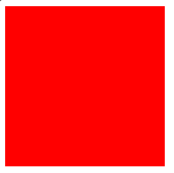
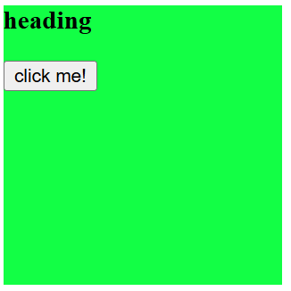
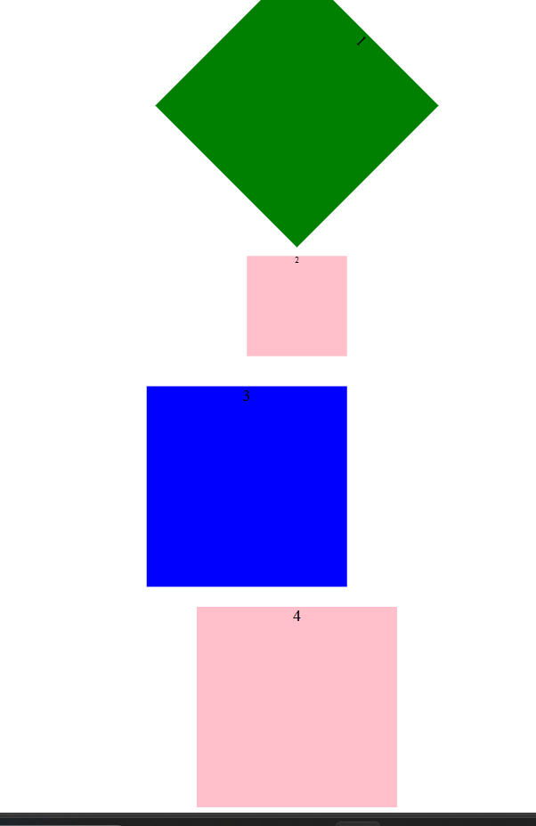

# css-effects-and-transforms
A collection of hands-on CSS examples covering transitions, transforms, opacity, shadows, and hover effects.

# Concept Covered

## Alpha
## opacity
## Box-shadow
## transitions
## transform

# Output

